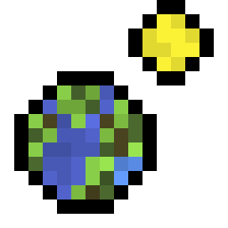
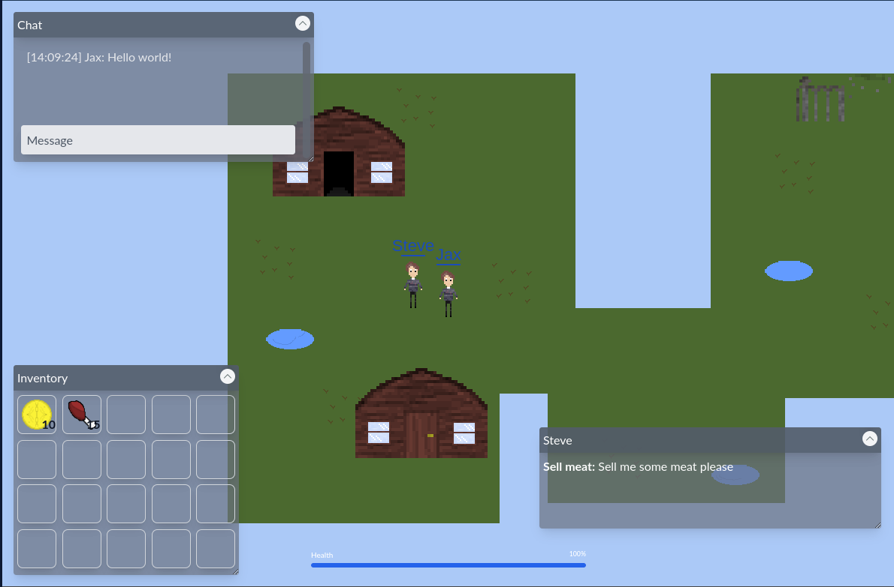

<p align="center">
    
</p>

# JaxWilko.Game
A Winter CMS plugin that provides a multiplayer game engine running in PHP for 2D sprite based games using HTML5 Canvas
and WebSockets.



## Features
- Browser based
- Multiplayer
- Quests
- Items
- Inventory
- Level Editor
- Scriptable Entities
- Scriptable Triggers
- Scriptable Item Objects
- Scriptable Inventory Objects
- Scriptable Sprites
- Teleporters (local & cross level)
- Entity AI (multiple modes)

## Requirements
- `php >= 8.2`
- `ext-posix`
- `ext-pcntl`
- `ext-sockets`

## Install

```bash
composer require jaxwilko/wn-game-plugin
php artisan migrate
php artisan mix:install
php artisan mix:compile -f -p jaxwilko.game
php artisan game:publish
```

> For a detailed installation guide including server configuration and level editing, see: [Getting Started](./docs/getting-started.md).

## Running
To run the game server with the demo level, execute:
```php
php artisan game:serve -f -m demo
```
The game server can be started via the backend control panel or via the CLI (in both fg and daemonized modes).
See the help page for details:
```php
php artisan game:serve -h
```

## Demo

If you would like to run a local demo, [check out this repo](https://github.com/jaxwilko/winter-game-demo).

## Why?
I thought it would be funny and nobody stopped me, for more see [development notes](./docs/development.md).

## Thanks
<table align="center">
    <tr>
        <td align="center" width="250px">
            <a href="https://github.com/luketowers">
            
            <br /><sub><b>Luke Towers</b></sub>
            </a>
            <br />
            <p>Putting up with my rambling, testing and reviewing</p>
        </td>
        <td align="center" width="250px">
            <a href="https://github.com/robertalexa">
            
            <br /><sub><b>Robert Alexa</b></sub>
            </a>
            <br />
            <p>Listening to me complain about pathing logic</p>
        </td>
        <td align="center" width="250px">
            <a href="https://github.com/josh-gaby">
            
            <br /><sub><b>Josh Gaby</b></sub>
            </a>
            <br />
            <p>Patching Ratchet for php8</p>
        </td>
    </tr>
</table>
