# Development Notes
This article is intended to share my experience of developing a game engine.

## How to build a game engine, in a CMS, in PHP
Don't. Seriously, it's not a good idea.

That being said... let me tell you how I did it and why.

## Creating a rendering system
Many years ago, I was working at a company where on Friday afternoons we would have a full team meeting, however one
person had to stay on call at their desk. On one fateful Friday it was my turn and as a young dev I wanted to spend my
unmonitored time doing something cool.

I created a neat little single page for myself which included an x/y colouring system which allowed the user to colour
in the page converting their mouse coords into an RGB colour. I thought this was neat and published it as the background
for my personal website.

At some point I had a message from a LinkedIn recruiter telling me that they had just wasted 20 minutes colouring in my
website. I found this hilarious and decided to make my personal page even more interactive.

I then re-wrote the page using some nice JS to display cube wireframes that rotated and looked super cool. With the
addition of mouse collisions, it was super neat and I published it over my old colouring in site. It's still up to this
day at [jackwilky.com](https://jackwilky.com/) (It's a 50/50 chance to get the nice cubes or a particle connection
effect). Source code here: [github.com/jaxwilko/website](https://github.com/jaxwilko/website).

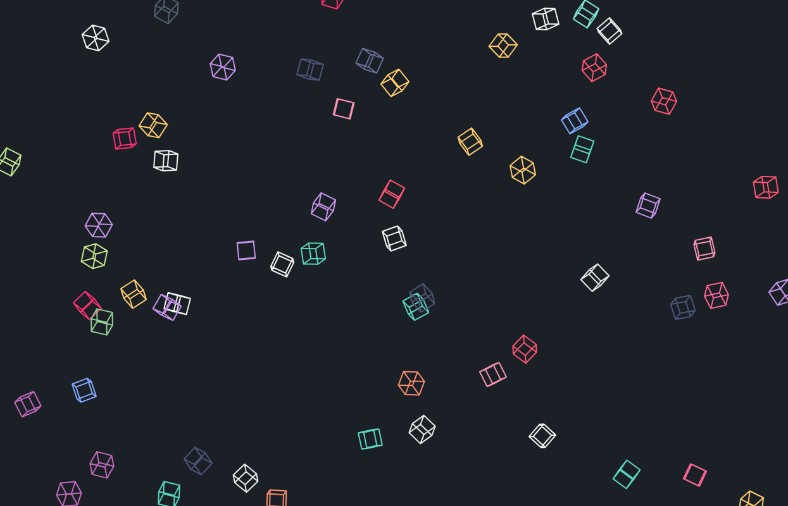

So I now have a kinda cool rendering system for 2D canvas drawing, what else can I do with this thing, I thought...

## Creating a game engine vs creating a game
Years ago I worked with a very experienced game dev at an e-commerce shop. A very good quote of hers I remember well was
> "If you're going to build a game, use a game engine. If you want to build a game engine, you will never make a game"

This stayed with me over the years and when I finally got around to this project I decided I was not building a game.
A game requires assets production and skills that I do not have. A game engine however was a far better usage of my
existing skill set.

## So, building a game engine
In short, a game engine is just a loop that takes user input, processes game logic, then feeds back to the client, i.e.
```php
while (!$exit) {
    $userInput = getUserInput();
    $result = processGameLogic($userInput);
    sendToUser($result);
}
```
Because I already had a JS rendering system I thought why not do this in JS? Unfortunately I no longer have the code
for that version of the engine, but it looked something like:
```
engine/
    rendering/
        camera.js
        world.js
    utils/
        vector.js
        random.js
    controls.js
    events.js
```
This was okay, but I didn't get far before I was distracted by other projects. When I finally came back to the idea of
building a custom game engine I decided it should be a multiplayer game, and therefore I needed to
start again with a Server <=> Client model.

Could I have done this in JS? Yeah, but that wouldn't be as fun a challenge.

## Writing a game engine in PHP
PHP was not written for this, it's a templating language... Well it used to be, modern PHP is a very versatile language
offering some really neat features. So why can't you run a game on PHP? This sounded like a challenge to me and, not one
to be afraid of a challenge, accepted.

To start with, we should define some concepts.
- `Client` - The end user's browser and the code executed within it.
- `Server` - The game server running the PHP code.
- `Levels` - An object that contains `WorldObject`s

### Why a game engine in a CMS?
Laravel is awesome. Winter CMS is Laravel with extra steps to make your life easier. Creating a game engine is a lot of
work and being able to build it on top of features, such as the backend form system and the `Winter.User` auth system,
saved so much time and effort.

### Getting started
The first thing I had to do was take all the logic from my JS implementation and refactor it into PHP. This was
painful as when you're working with JS you can just draw to the screen to display what's happening internally in the
engine, while in PHP all I had was numbers that didn't help much.

GD to the rescue. [php-gd](https://www.php.net/manual/en/book.image.php) is a package that adds the ability to render
pictures directly from PHP. Using GD allowed me to render level data without having to connect the client to the server,
eliminating any rendering bugs in the client.

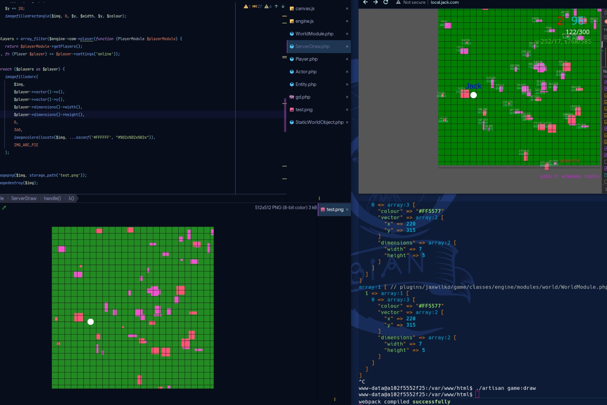

Once I had the basic world data being generated by the server, I was able to connect the client to the server.

### Websockets
To do this I chose to use websockets with JSON objects being passed between the client and the server. This is not the
most efficient way to do this, using something like [protobufs](https://protobuf.dev/) would have been better but JSON
makes it easier to debug and read messages; so until I hit a wall that forces me to change, JSON is the way it is.

Working within a Winter CMS application, my first thought was to look at [Laravel Echo](https://github.com/laravel/echo).
However, Echo is great for Server -> Client "broadcasting", but not so much for Server <- Client communication - you
can do it, but it requires some hacking.

So what else... [Ratchet](https://github.com/ratchetphp/Ratchet/) is an older library, but it does everything I needed.

### Getting Ratchet working
This took a little tinkering, but in the end I created a [`GameApplication`](../classes/engine/network/GameApplication.php)
which handled all the networking for me and allowed me to trigger events on the engine to dispatch tasks.

Spawning the game server in [`GameServe`](../console/GameServe.php) also provided a `React\EventLoop` which allowed me
to use that loop to handle my engine's game loop.
```php
$app = new GameApplication($settings);
// ...
$server->loop->addPeriodicTimer($app->getEngine()->getTickRate(), function () use ($app) {
    $app->onTick();
});
```

### This is where it gets complicated
We now have a Server Client system working: the player can move, but not much else happens. We're going to need to add
a few things:

- What is a level?
  - What is a world object?
- World boundary
- Players
- NPCs
- Server side collision
- Sending just the data needed to the client
- Object collision when players move
- Some sort of animation system
- Interactions
- A whole load of other features

#### Levels
I decided early on I wanted to break down levels into distinct layers, this would allow me to execute functions against
a specific layer and not have to check all objects for their types during a game loop tick.

It also allowed for things like player collision detection against specific layers, allowing players to walk over
background objects, but get blocked by block objects.

> Side note: I've done quite a bit of tinkering with Counter-Strike mapping (and many, many years ago Halo CE mapping),
> so a lot of the concepts used have been pinched from the Hammer editor.

##### Vectors
A vector is an object that contains a matrix of one row and one column. In my engine the [`Vector`](../classes/engine/core/utils/Vector.php)
Object also contains useful methods to do things like:

- convert to a string or an array.
- tap - move the current coord by N amount
- dry - create a new object with X,Y changes

##### WorldObjects
Everything inside a level's layers is a [`WorldObject`](../classes/engine/core/objects/WorldObject.php), this makes
life easy as everything share the base properties of `vector` and `size`, both represented as `Vector` objects.

#### World Boundary
Really simply, we can use a helper on the player's `Vector` object to prevent the vector exceeding a certain value,
0 for the top and left borders, and then the level size for the right and bottom borders
```php
public function applyControls(array $controls, Level $level): static
{
    $worldSize = $level->getSize()[1]->get();

    if (($controls['up'] ?? null)) {
        $this->vector->tapY(-$this->speed, 0);
    }

    if (($controls['down'] ?? null)) {
        $this->vector->tapY($this->speed, $worldSize[1] - $this->size->y());
    }

    if (($controls['left'] ?? null)) {
        $this->vector->tapX(-$this->speed, 0);
    }

    if (($controls['right'] ?? null)) {
        $this->vector->tapX($this->speed, $worldSize[0] - $this->size->x());
    }

    return $this;
}
```

#### Collisions
The maths for this is fairly simple, we just check if 2 objects intersect, this can be expressed as
```php
public function intersects(WorldObject $object): bool
{
    return (
        $this->vector->x() < ($object->vector->x() + $object->size->x())
        && ($this->vector->x() + $this->size->x()) > $object->vector->x()
    ) && (
        $this->vector->y() < ($object->vector->y() + $object->size->y())
        && ($this->vector->y() + $this->size->y()) > $object->vector->y()
    );
}
```

With the approach of everything in the level being based on a `WorldObject`, this now means that everything can have
collision detection.

#### Sending only the data required to the client
I decided early on that we should only send data to the players that they need. In a big game this would have the
advantage of preventing hackers from being able to create wall-hacks, but for us this is basically an optimisation to
reduce transfer size.

So what data does the player need? Well they need data only from their current level, and only what their `camera`
can see.

Enter level searching, at this point I implemented a `$level->search()` method, this allows you to check which world
objects intersect a passed world object.

So with that we can then search the `Level` for objects matching the player camera.

How should we represent the camera? Maybe something complex and complicated? Nope, just get the size of the view port,
put the player in the middle of it and calculate its vector based on some maths:
```php
$camera = [800, 600];
$vector = [
    (int) ($player->x() - ($camera[0] / 2)),
    (int) ($player->y() - ($camera[1] / 2)),
];

$objects = $level->search(
    new WorldObject(
        new Vector(...$vector),
        new Vector(...$camera)
    )
);
```

#### Object collision when players move
Using the fancy new level search feature, we can now check if a position we're moving into is occupied by a blocking
object and if so prevent the player from moving.
```php
public function applyControls(array $controls, Level $level): static
{
    $worldSize = $level->getSize()[1]->get();

    if (($controls['up'] ?? null) && !$this->isBlocked($level, 'y', -$this->speed)) {
        $this->vector->tapY(-$this->speed, 0);
    }

    if (($controls['down'] ?? null) && !$this->isBlocked($level, 'y', $this->speed)) {
        $this->vector->tapY($this->speed, $worldSize[1] - $this->size->y());
    }

    if (($controls['left'] ?? null) && !$this->isBlocked($level, 'x', -$this->speed)) {
        $this->vector->tapX(-$this->speed, 0);
    }

    if (($controls['right'] ?? null) && !$this->isBlocked($level, 'x', $this->speed)) {
        $this->vector->tapX($this->speed, $worldSize[0] - $this->size->x());
    }

    return $this;
}

public function isBlocked(Level $level, string $prop, int $amount): bool
{
    return !empty(
        $level->search(
            new WorldObject($this->vector->dry($prop, $amount), $this->size),
            blockingLayers: $this->blockingLayers,
            flatten: true,
            ignore: $this->id
        )
    );
}
```

#### Some sort of animation system
Cool, so now we can move, and we get blocked when we walk into things, but these moving cubes aren't very exciting.
Let's fix that.

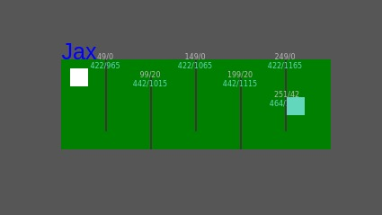

The animation system went through a lot of changes. Sadly I don't have copies of the older system, however the new one
can be found here: [`HasAnimations`](../classes/engine/core/objects/traits/HasAnimations.php) and an implementation of
animations in the player object: [`Player`](../classes/engine/modules/player/Player.php).

In short, anything implementing `HasAnimations` will have a `spriteMap` property and an `animation` property.
The `spriteMap` contains configuration for different animation states. The configuration is as follows:
- `sheet` - The sprite-sheet, which is the image to use for the animation.
- `align` - How each sprite within the sheet should be aligned.
- `delay` - The delay between each sprite in the sheet.
```php
protected array $spriteMap = [
    'idle' => [
        'sheet' => '/plugins/jaxwilko/game/classes/engine/assets/dude/idle.png',
        'align' => [32, 64],
        'delay' => 45
    ],
    'attack' => [
        'sheet' => '/plugins/jaxwilko/game/classes/engine/assets/dude/attack.png',
        'align' => [32, 64],
        'delay' => 10
    ],
    'down' => [
        'sheet' => '/plugins/jaxwilko/game/classes/engine/assets/dude/walk-down.png',
        'align' => [32, 64],
        'delay' => 15
    ],
    // ...
];
```

When sent to the client, each WorldObject implementing `HasAnimations` will have its `animation` property checked, then
use the config provided by the `spriteMap` to display the correct animation.

Next, we need to work out how to implement directional animation states for when the player is moving. Because we
already have controls working out which direction the player is moving, we can simply set it after updating the vector.
```php
public function applyControls(array $controls, Level $level): static
{
    $worldSize = $level->getSize()[1]->get();

    $this->animate('idle');

    if (($controls['up'] ?? null) && !$this->isBlocked($level, 'y', -$this->speed)) {
        $this->vector->tapY(-$this->speed, 0);
        $this->animate('up');
    }

    if (($controls['down'] ?? null) && !$this->isBlocked($level, 'y', $this->speed)) {
        $this->vector->tapY($this->speed, $worldSize[1] - $this->size->y());
        $this->animate('down');
    }

    if (($controls['left'] ?? null) && !$this->isBlocked($level, 'x', -$this->speed)) {
        $this->vector->tapX(-$this->speed, 0);
        $this->animate('left');
    }

    if (($controls['right'] ?? null) && !$this->isBlocked($level, 'x', $this->speed)) {
        $this->vector->tapX($this->speed, $worldSize[0] - $this->size->x());
        $this->animate('right');
    }

    return $this;
}
```

But what about NPCs? Ah well I may have lied a little, all of these controls have been implemented in the [`Actor`](../classes/engine/core/objects/entities/Actor.php)
class, this means that NPCs automatically get all the same animation support as players.

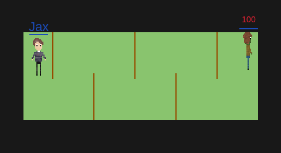

If you'd like to look at the client side rendering for sprites, then the code can be found here: [sprites.js](../classes/engine/client/src/renderer/sprites.js).

#### Interactions
What is an interaction? A simple interaction could be the player attacking something.

How should this work? At a very basic level, when the player is holding the `attack` key, they should attack anything
near them.

To do this we first need to search for any actors near the player, we can again use our `Level` search feature to do
this.
```php
foreach ($level->search($indicator, [Level::LAYER_ACTORS], asObjects: true, ignore: $this->id, flattern: true) as $actor) {
    $this->attack($actor);
}
```

However, this does not visually feed back to the player that they are attacking. To improve this we can add a `Sprite`
to the level at the coords of the player to show a nice effect.
```php
public function executeAttack(Level $level): void
{
    $indicator = new Poof(
        new Vector($this->vector->x - 5, $this->vector->y - 5),
        new Vector($this->size->x + 10, $this->size->y + 10)
    );

    if (!$level->search($indicator, [Level::LAYER_SPRITES], false, null, true)) {
        $level->pushLayer(Level::LAYER_SPRITES, $indicator);
    }

    foreach ($level->search($indicator, [Level::LAYER_ACTORS], true, $this->id, true) as $actor) {
        $this->attack($actor);
    }
}
```

The `$indicator` object can also be used to perform our search as it is slightly bigger than the Player object and will
allow us to detect when an enemy is close but not intersecting with our player.

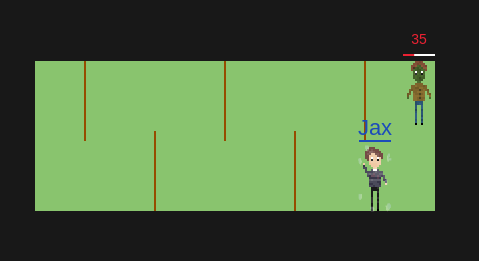

Once we have our `executeAttack()` method, we can add it to our `applyControls()` method by adding an extra control check of:
```php
if ($controls['attack'] ?? null) {
    $this->executeAttack($level);
    $this->animate('attack');
}
```

### Recap
So we now have:
- Levels
- WorldObject
- Players
- NPCs
- Animations for WorldObjects

Is this a game? Kind of, but it's not very fun yet, so why don't we add some challenge by getting the NPCs to attack
the player.

This will require the NPC to be able to path find towards the player, should be simple right?

### Pathing
To keep things simple, I first implemented pathing without any objects in pure PHP using basic types. This meant it was
easy to identify bugs that could have been caused by other parts of the engine and fix the pathing before it was all
mixed up with the engine internals.

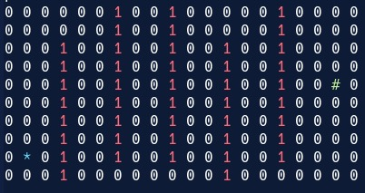

This is a fun code golf type of puzzle, here we have our player (`*`) and the NPC (`#`) and we need to plot a path
avoiding the walls (`1`).

If anybody fancies trying this, I've left the setup for the challenge here: [pathing-golf.php](./pathing-golf.php).

After reading through some implementations of A*, I ended up with something that looked like it should work:

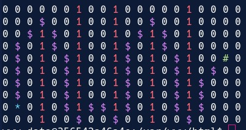

Awesome, now with some tinkering we can take that pathing system and force it into our engine, the end result being
[`Pathing`](../classes/engine/core/utils/Pathing.php).

Let's try it with lots of NPCs...

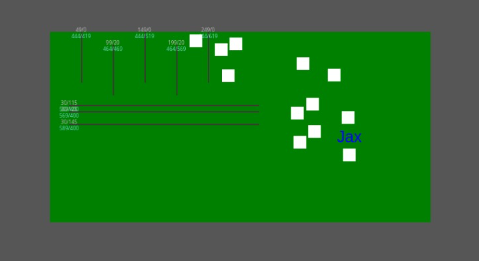

Neat, it works! But the one drawback is that multiple NPCs executing the heavy pathing logic on a single thread heavily
impacts performance. That's suboptimal...

#### How can we speed up single thread performance in PHP?
Well, a simple way would be to add more threads... So that's what I did. Initially this was all part of the `Engine`,
however towards the completion of the functionality I split it out into its own project, [`WeirdPHP`](https://github.com/jaxwilko/weird-php),
so it could be used for probably more useful things.

`Weird` allows you to run multiple child processes with IPC between parent and child processes.

It was a fascinating project to work on as I had to delve deep into the Linux kernel's process management to work out
why things kept breaking.

If anybody wants me to write up the journey I went on with Weird then feel free to reach out and ask :).

#### So now we can just run pathing logic in a worker thread right?
Ahh... No. Due to the way that `Level`s stored data, all the data would be bundled under a level key, this meant that if
a child process updated a level, it may cause a race condition for other worker threads, or those changes wouldn't be
reloaded correctly by the level.

So how do we fix that?

Well, basically I rewrote the whole engine. Moving from object being stored under the level to references to world
objects. This way when you need an object you can call it from the cache, modify it and save it, the resulting object is
then available for both the main process and the child processes.

#### Awesome, what else can we do with all this cool tech?
I got really smart at this point, I thought, "Well, now the most impactful thing on the engine tick event is processing
player input and output, maybe we can offload that." This was not a good idea as it meant the player data that is stored
across both the [`PlayerModule`](../classes/engine/modules/player/PlayerModule.php) and the [`WorldModule`](../classes/engine/modules/world/WorldModule.php)
would get out of sync, breaking level transitions when a player moved from one level to another.

I reverted these changes pretty quickly and returned player processing to the main thread.

## Level Editor
Up to this point, I'd been working with just JSON files. This worked for me but for real people just editing a JSON file
would not be okay.

Luckily for us, adding custom `FormWidget`s to Winter CMS is really easy! Unluckily creating a level editor is actually
quite a challenge.

The first step I took was to pull in the rendering library [`canvas.js`](../classes/engine/client/src/renderer/canvas.js)
from the client, this meant I could leverage all the work I had done on the client to render a preview of the level
with minimal effort.

Step 2 was generating the level data. For this I decided to use [Vue](https://vuejs.org/) + [Vuex](https://vuex.vuejs.org/).
This allowed me to model the data in memory and have Vue push updates to the preview when data was changed. I started
with simply setting world/void colours and the world size, this was fairly easy, however I soon realised that the world
would need to be pan-able so that users would be able to see the whole world at once.

This was actually a fairly simple fix. I created a "fake" camera object that would usually be supplied by the server in
the client, then manipulate it based on a `mousemove` event on the canvas element.
```javascript
this.canvas = new Canvas(this.$refs.drawer);
this.camera.size.x = this.canvas.canvas.width;
this.camera.size.y = this.canvas.canvas.height;
this.camera.vector.x = (this.canvas.canvas.width / 2) - (this.$store.getters.world.level.size[1][0] / 2);
this.camera.vector.y = (this.canvas.canvas.height / 2) - (this.$store.getters.world.level.size[1][1] / 2);

// ...

this.$refs.drawer.addEventListener('mousemove', (e) => {
    if (dragging) {
        this.camera.vector.x -= e.movementX
        this.camera.vector.y -= e.movementY
    }
});

// ...

this.canvas.resize(this.camera);
```

After this was done, all that was left was allowing the user to create objects in the level layers, with different
objects having different options, driven by [plugin registration methods](https://wintercms.com/docs/v1.2/docs/plugin/registration#registration-file)
from Winter to allow for extendability.

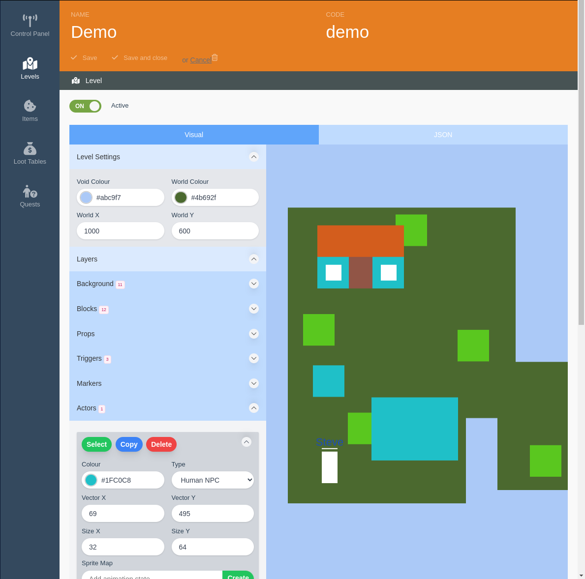

A key feature for me was retaining the functionality of being able to modify the JSON directly, this made life really
easy when doing things like changing colours of objects.

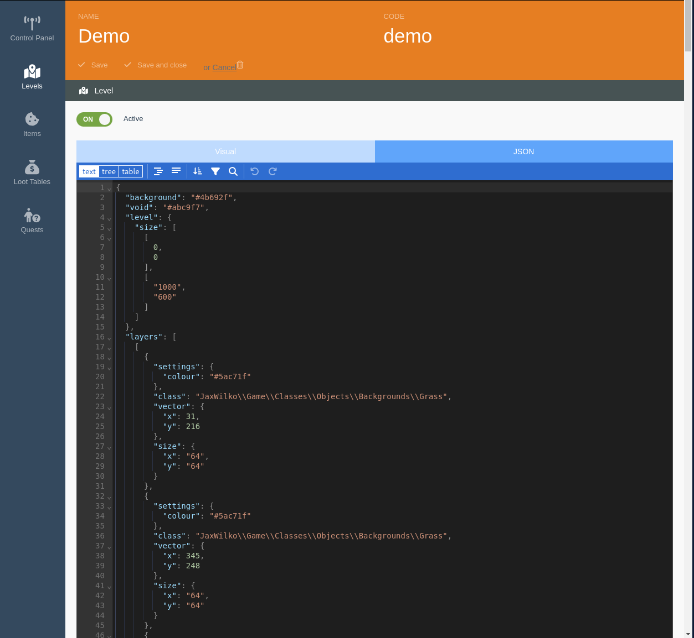

## Trigger objects
Something I stole from the Hammer editor was the concept of triggers; [`TriggerObjects`](../classes/engine/core/objects/StaticTriggerObject.php)
allow the level designer to add custom functionality when a player interacts with an object.

To start with, I created a trigger object that would do damage to the player when they walked into it.
```php
use JaxWilko\Game\Classes\Engine\Core\Contracts\Modules\WorldModuleInterface;
use JaxWilko\Game\Classes\Engine\Core\Objects\StaticTriggerObject;
use JaxWilko\Game\Classes\Engine\Core\Utils\Vector;
use JaxWilko\Game\Classes\Engine\Modules\World\Level;

class Fire extends StaticTriggerObject
{
    protected int $damage = 1;

    public function __construct(Vector $vector, Vector $size, array $settings = ['colour' => '#DEA010'])
    {
        parent::__construct($vector, $size, $settings);
    }

    public function tick(Level $level, WorldModuleInterface $world): void
    {
        $entities = $this->getActorsInside($level);

        if (!$entities) {
            return;
        }

        foreach ($entities as $entity) {
            $entity->damage($this->damage);
            $entity->save();
        }
    }
}
```

This worked really nicely, so I then added the [`GenericStaticTriggerObject`](../classes/engine/core/objects/generic/GenericStaticTriggerObject.php)
which allowed the user to add custom trigger scripting via the level editor.

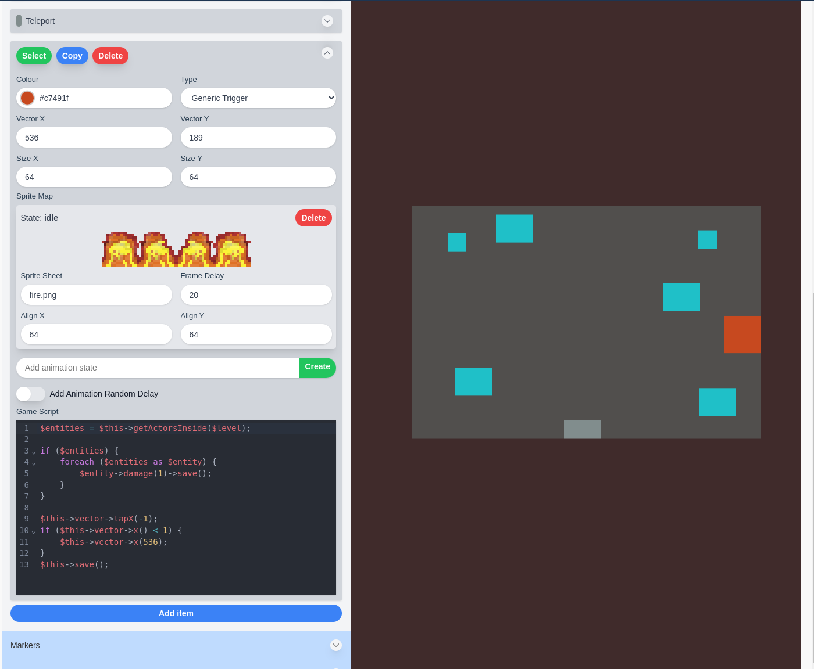

In this example, the `Generic Trigger` object has been configured with a sprite animation of a fire, then in its custom
code it searches for all actors inside itself, applying one damage to each, then moving its x coord to x - 1 until
it reaches 0 and then resets back to 536.

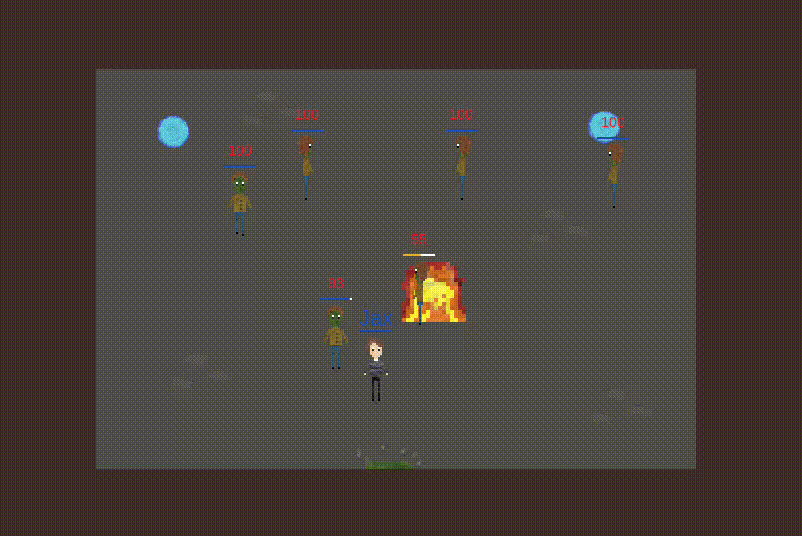

After adding a basic trigger, I decided to do something more complicated and add [`Teleport`](classes/objects/triggers/Teleport.php).
This allows the level designer to create an object that when entered repositions the player both within the current
level and also between levels.

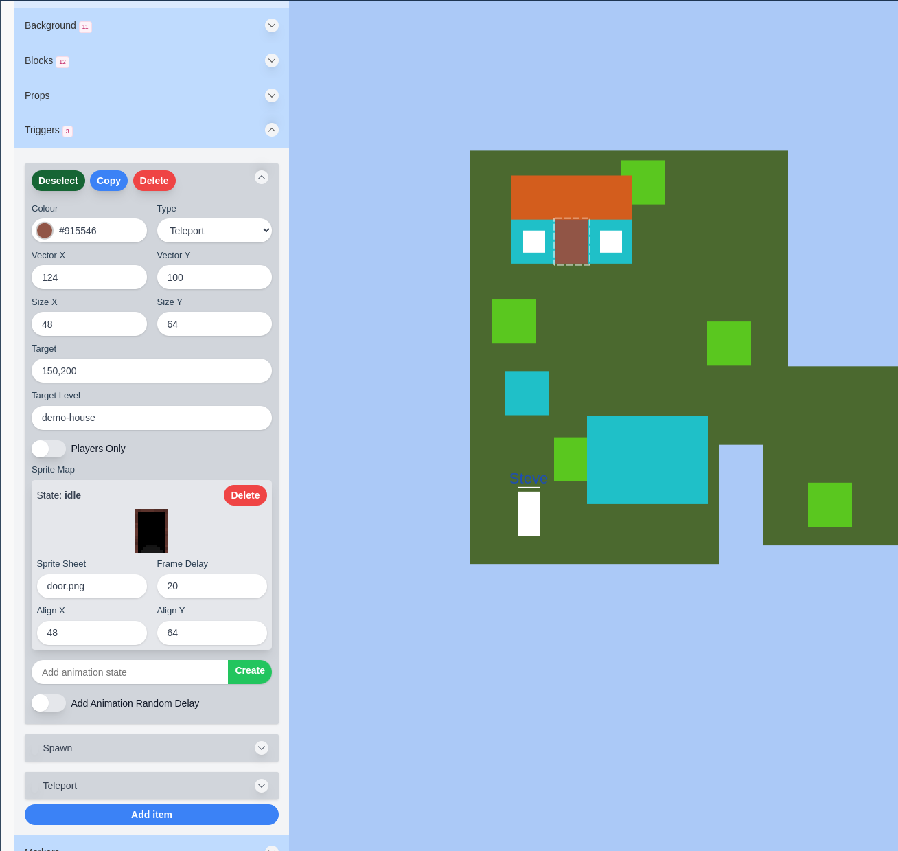

For teleporting within a level, the logic is quite simple, simply updating the entity's `vector` property.
```php
foreach ($entities as $entity) {
    $entity->getVector()->set($this->target->x, $this->target->y);
    $entity->save();
}
```

However, when teleporting an entity across levels, it becomes a little more complex. First we need to remap the entity
in the world module's actor map:
```php
$world->removeActor($entity);
$world->addActor($this->level, $entity);
$world->store();
```
Next find a position that won't collide with any existing objects:
```php
$vector = $level->getSpawnablePosition(
    (new WorldObject($this->target, $entity->size))->getSurroundingArea(),
    $entity->getSize()->clone(),
    fast: true
) ?? $this->target;
```
And finally move the actor to their new position:
```php
$entity->getVector()->set($vector->x, $vector->y);

// Fix for player camera alignment
if (method_exists($entity, 'alignCamera')) {
    $entity->alignCamera();
}

$entity->save();
```

After all that, we get nicely working teleporters that allow the entities to move between levels.


## Subsystems
To be a real game you need to have objectives of some sort, so I added a questing system, which is configurable both via
Winter plugin registration methods and via the backend UI.

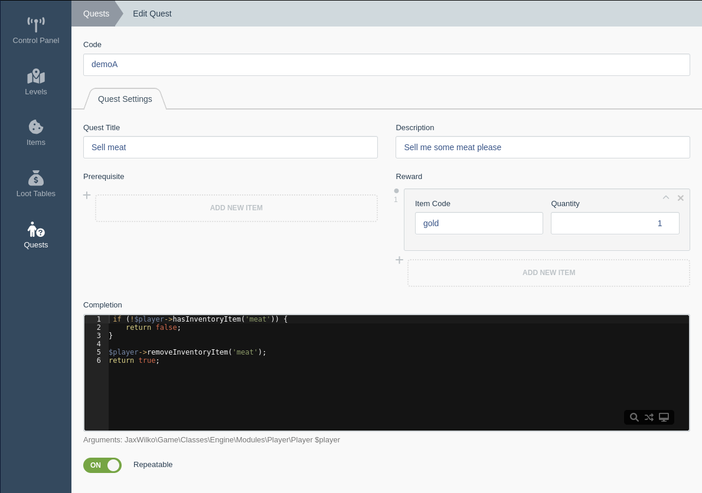

Next comes items and inventory management, this was not very exciting, but again, these things can be registered both in
code and via the editor.

## Conclusion
So, can you build a game engine in PHP, in a CMS? Yes. Should you? Probably not, unless you're looking for a challenge
and then yeah go for it!

During this project I learned a great many things about the internal workings of PHP, how to improve application
performance with worker threads, how to daemonize processes in PHP, and a great many other things.

My favourite part of the project was working on [`WeirdPHP`](https://github.com/jaxwilko/weird-php). `Weird` allows you
to do some really cool things like processing data across workers, or generate multiple images all in parallel. It will
be exciting to see what other uses cases it has and to improve support for custom worker processes.

I really hope that people will try out the engine and attempt to make their own games with it, it would be soo cool to
see people having fun with this project.

What's next? Maybe add in that third dimension...
