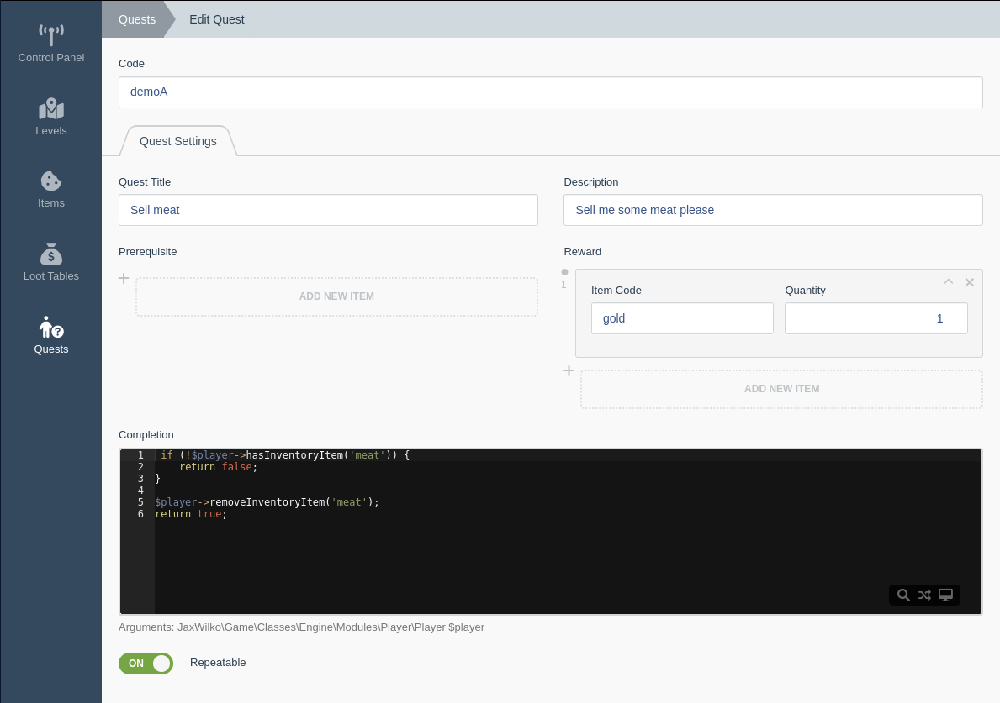

# Getting Started

This plugin relies on websockets, they are used for player/server bidirectional communication. To ensure security,
the `wss` protocol is used. The practical importance of this is that no packages for PHP currently implement `wss`,
therefore you need some sort of reverse proxy to handle the ssl negotiation for you.

How the game is configured to run, it will try to connect to `/ws`, if you require something else then YMMV.

For nginx, you can use something like the following:
```nginx configuration
location /ws {
    proxy_pass http://127.0.0.1:2345/;
    proxy_http_version 1.1;
    proxy_set_header Upgrade $http_upgrade;
    proxy_set_header Connection "upgrade";
    add_header X-location websocket always;
}
```

The game engine also relies on the following php extensions:
- `posix`
- `pcntl`
- `sockets`

The auth system used for the game is `Winter.User`, you will need this plugin installed if you don't have it already.

You will need to insure your host has these extensions installed and available.

## Plugin installing

First you will need to install the plugin, this can be done via composer with:
```bash
composer require jaxwilko/wn-game-plugin
```
Next, migrate the plugin with:
```bash
php artisan migrate
```
Then compile the game assets, you will need node installed to do this:
```bash
php artisan mix:install
php artisan mix:compile -f -p jaxwilko.game
```
Finally, you will need to publish the game assets, to do this run the following:
```bash
php artisan game:publish
```

## Extending
You can register custom game code via the same method as you would with any other winter plugin.

### Config
You can extend the default game [config](../config/config.php) using the [Winter File-based configuration](https://wintercms.com/docs/v1.2/docs/plugin/settings#file-based-configuration)
feature.

There are env args that can be set to configure some features without needing to overwrite the plugin config.
- `JAX_GAME_TICKS` - Sets the tick rate for the engine to target.
- `JAX_GAME_PORT` - Sets the port for the websocket server to run on.
- `JAX_GAME_DEBUG` - Enables debug features, including debug player commands and debug levels.

### Registration
The game engine supports registration of items, loot tables, quests, custom commands, game objects & game object
options.

Items, Loot tables, quests & levels can all be created and managed via backend forms, these will be noted under their
plugin registration counterparts.

#### registerGameItems
This allows you to register custom game items, the key of each item will be used as it's item code internally by the
engine. The usage function is optional, and is passed the [`Entity`](../classes/engine/core/objects/entities/Entity.php)
that used the item.
```php
use JaxWilko\Game\Classes\Engine\Core\Objects\Entities\Entity;

public function registerGameItems(): array
{
    return [
        'gold' => [
            'label' => 'Gold',
            'description' => 'It gold',
            'value' => 1,
            'size' => [24, 24],
            'icon' => '/plugins/jaxwilko/game/classes/engine/assets/gold/icon.png',
            'usage' => function (Entity $entity) {
                // ...
            },
            'spriteMap' => [
                'idle' => [
                    'sheet' => '/plugins/jaxwilko/game/classes/engine/assets/gold/gold.png',
                    'align' => [24, 24],
                    'delay' => 20
                ],
            ],
        ],
        // ...
    ];
}
```

Items can be managed via the backend interface.


#### registerGameLootTable
This allows you to register custom loot tables, each loot table is identified by it's key. A loot table is used to
generate dropped items when an [`Entity`](../classes/engine/core/objects/entities/Entity.php) implementing
[`HasInventory`](../classes/engine/core/objects/traits/HasInventory.php) calls `dropInventory`.

A loot table is described as `'itemCode' => 0.5  (0-1 float chance)`.
```php
public function registerGameLootTable(): array
{
    return [
        'zombie' => [
            'meat' => 0.5,
            'gold' => 1 / 6
        ],
        // ...
    ];
}
```

Loot tables can be managed via the backend interface.


#### registerGameQuests
Quests allow for the player to preform actions in game and receive rewards.

A quest can contain `prerequisite`, this is an array of quests that must be completed before the quest will become
available.

Quests can also optionally include a `completion` callable, this will be executed before a quest is marked as complete
and must return a `bool` value.
```php
public function registerGameQuests(): array
{
    return [
        'exampleA' => [
            'title' => 'Acquire meat',
            'description' => 'Return 1 meat to the quest giver',
            'reward' => [
                'gold' => 5
            ],
            'repeatable' => false,
            'completion' => function (Player $player): bool {
                if (!$player->hasInventoryItem('meat')) {
                    return false;
                }

                $player->removeInventoryItem('meat');
                return true;
            }
        ],
        'exampleB' => [
            'title' => 'Buy Meat',
            'description' => 'Exchange 5 gold for 1 meat',
            'prerequisite' => [
                'exampleA'
            ],
            'reward' => [
                'meat' => 1
            ],
            'repeatable' => true,
            'completion' => function (Player $player): bool {
                if (!$player->hasInventoryItem('gold', 5)) {
                    return false;
                }

                $player->removeInventoryItem('gold', 5);
                return true;
            }
        ],
        // ...
    ];
}
```

Quests can be managed via the backend interface.


#### registerGamePlayerCommands
This allows players to write `/command example` into the in game console, it's very useful for debugging however could
also be useful for gameplay.

> Note: The callable is executed within the context of the [`PlayerModule`](../classes/engine/modules/player/PlayerModule.php)

The array key is used as the command, in this example the command registered is `/pos` which pushes a message back to
the player with their current position.
```php
public function registerGamePlayerCommands(): array
{
    return [
        'pos' => function (string $id, string $message, Player $player, string $timeStamp, float $time) {
            $this->messages[$id][$timeStamp] = $this->packMessage(
                'System',
                $player->getVector()->toString(),
                $time
            );
        },
        // ...
    ];
}
```

#### registerGameObjects
This method allows you to register game object for the level editor. Technically, the engine can load any class without
it necessarily being registered, however if you want to use the editor to modify those objects it will need to be
registered first.

The returned array should be an array of arrays indexed by the level layer. Available layers are:
- `Level::LAYER_BACKGROUND`
- `Level::LAYER_BLOCKS`
- `Level::LAYER_PROPS`
- `Level::LAYER_TRIGGERS`
- `Level::LAYER_MARKERS`
- `Level::LAYER_ACTORS`
- `Level::LAYER_SPRITES`
- `Level::LAYER_PROPS_TOP`

Within the layer array, the class should be used as the key and value should be the display name, i.e.
`\Author\MyClass::class => 'My custom thing'`
```php
use JaxWilko\Game\Classes\Engine\Modules\World\Level;

public function registerGameObjects(): array
{
    return [
        Level::LAYER_BACKGROUND => [
            Classes\Objects\Backgrounds\Grass::class => 'Grass'
        ],
        Level::LAYER_TRIGGERS => [
            Classes\Objects\Triggers\Teleport::class => 'Teleport',
            Classes\Objects\Triggers\Spawner::class => 'Spawner',
            Classes\Objects\Triggers\Spawn::class => 'Level Spawn Point',
            Classes\Objects\Triggers\Inventory::class => 'Inventory',
            Classes\Objects\Triggers\Fire::class => 'Fire'
        ],
        Level::LAYER_ACTORS => [
            Classes\Objects\Entities\Npc::class => 'Human NPC',
            Classes\Objects\Entities\Zombie::class => 'Zombie',
        ],
        // ...
    ];
}
```

#### registerGameObjectOptions
Game object options define the available configuration options available for an object within the level editor.

The available options are:
- `LevelEditor::OBJECT_OPTION_SPRITE_MAP`
- `LevelEditor::OBJECT_OPTION_ANIMATION_RANDOM_DELAY`
- `LevelEditor::OBJECT_OPTION_SCRIPT`
- `LevelEditor::OBJECT_OPTION_TELEPORT`
- `LevelEditor::OBJECT_OPTION_PLAYERS_ONLY`
- `LevelEditor::OBJECT_OPTION_ITEM`
- `LevelEditor::OBJECT_OPTION_NAME`
- `LevelEditor::OBJECT_OPTION_QUESTS`
- `LevelEditor::OBJECT_OPTION_INVULNERABLE`
- `LevelEditor::OBJECT_OPTION_INVENTORY`

```php
use JaxWilko\Game\FormWidgets\LevelEditor;

public function registerGameObjectOptions(): array
{
    return [
        Classes\Objects\Triggers\Teleport::class => [
            LevelEditor::OBJECT_OPTION_TELEPORT,
            LevelEditor::OBJECT_OPTION_PLAYERS_ONLY,
            LevelEditor::OBJECT_OPTION_SPRITE_MAP,
            LevelEditor::OBJECT_OPTION_ANIMATION_RANDOM_DELAY,
        ],
        Classes\Objects\Triggers\Inventory::class => [
            LevelEditor::OBJECT_OPTION_INVENTORY,
            LevelEditor::OBJECT_OPTION_SPRITE_MAP,
            LevelEditor::OBJECT_OPTION_ANIMATION_RANDOM_DELAY,
        ],
        Classes\Objects\Entities\Zombie::class => [
            LevelEditor::OBJECT_OPTION_SPRITE_MAP,
            LevelEditor::OBJECT_OPTION_ANIMATION_RANDOM_DELAY,
            LevelEditor::OBJECT_OPTION_SCRIPT,
        ],
        // ...
    ];
}
```

#### registerGameLevels
This allows you to register custom json objects as game levels. The key will be used as the level id.
```php
    public function registerGameLevels(): array
    {
        return [
            'exampleA' => __DIR__ . '/path/to/exampleA.json',
            'exampleB' => __DIR__ . '/path/to/exampleB.json',
            // ...
        ];
    }
```

Levels can be managed via the backend interface.

